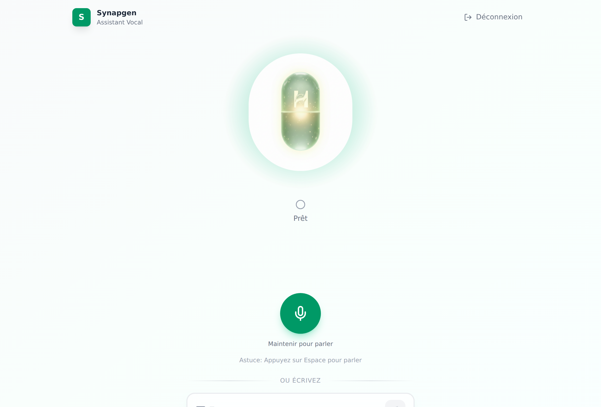

# MedVoice

A voice-first assistant a pharmaceutical rep can use hands-free during a doctor
visit. The rep holds a key, asks a question out loud in French, and the assistant
answers out loud — pulling live citations from PubMed when the doctor asks for
evidence.

Built for **Synapgen®** (magnesium L-threonate, SARL Handson, Algeria).



> **Live demo:** _(add URL here)_

## Why voice

A rep in a consultation cannot look things up on a laptop. The whole product is
one screen: hold to talk, listen to the answer. Everything else — chat history,
citation cards, the text box — is a fallback for when speaking is not an option.

## What it does

- **Push to talk.** Hold the button (or the space bar) on desktop, tap to toggle
  on mobile. A short beep marks the start and end of capture, so the rep knows
  the mic state without looking.
- **Live transcription and speech.** Browser-native `SpeechRecognition` and
  `speechSynthesis`, both pinned to `fr-FR`. Interim results stream in while the
  rep is still speaking. Nothing is uploaded — audio never leaves the device.
- **Citations from PubMed, fetched at question time.** When the doctor asks for
  evidence, the model calls a `searchPubMed` tool that hits the NCBI E-utilities
  API live (esearch → esummary → efetch) and the answer renders as citation
  cards linking to the PMID.
- **Speech-shaped output.** Markdown, tables and emoji are stripped before the
  text is spoken, and "Synapgen" is rewritten to "Synapjène" so French TTS
  pronounces it correctly. A correction table repairs common mis-hearings —
  `snap chat` → `Synapgen`, `mag teine` → `Magtein`, `l-tréonat` → `L-thréonate`.
- **Single shared password.** NextAuth credentials provider, 24-hour JWT
  session, middleware gate on every route. It is a sales-team tool, not a
  consumer app.

## Architecture

```
Browser  ──  hold to talk  ──▶  Web Speech API (fr-FR)  ──▶  transcript
                                                              │
   speechSynthesis  ◀──  cleanTextForSpeech  ◀──  SSE stream  │
                                                              ▼
                                         /api/chat  ──▶  Mistral (mistral-small-latest)
                                                              │
                                            searchPubMed tool ▼
                                                   NCBI E-utilities ──▶ citation cards
```

Five moving parts: a voice state machine (`idle → listening → thinking →
speaking`), the Vercel AI SDK streaming a Mistral completion, one tool the model
can call, a French system prompt carrying the product facts, and a NextAuth gate.

**A note on retrieval:** there is no vector store here. Product knowledge is
pinned in the system prompt (`lib/ai/system-prompt.ts`) because it is small,
fixed and must never drift; literature is fetched live from PubMed at question
time rather than embedded, so a citation is always the current record rather
than a snapshot. That is a deliberate trade-off, not a missing feature.

## Stack

| Layer | Choice |
|---|---|
| Framework | Next.js 16, React 19, TypeScript |
| Model | Mistral `mistral-small-latest` via Vercel AI SDK (`ai` v6) |
| Speech | Browser Web Speech API — recognition and synthesis, `fr-FR` |
| Retrieval | NCBI PubMed E-utilities, exposed as an AI SDK tool |
| Auth | NextAuth credentials provider, JWT |
| Styling | Tailwind CSS 4 |

## Run it

```bash
npm install
cp .env.example .env.local   # then fill in the three values below
npm run dev
```

```
MISTRAL_API_KEY=...     # https://console.mistral.ai
AUTH_PASSWORD=...       # the shared password the sales team types
NEXTAUTH_SECRET=...     # openssl rand -base64 32
```

Open http://localhost:3000 and allow microphone access. Speech recognition needs
a Chromium-based browser; Firefox has no `SpeechRecognition` implementation.

## Layout

```
app/
  api/chat/route.ts        streaming endpoint, tool wiring
  login/                   shared-password sign-in
components/
  voice/                   capsule, push-to-talk, particles, status, transcript
  chat/                    message list, citation cards, avatar
lib/
  ai/system-prompt.ts      French system prompt: product facts, posology, studies
  ai/tools/pubmed-search.ts  the searchPubMed tool definition
  pubmed/api.ts            NCBI E-utilities client
  hooks/use-speech.ts      SpeechRecognition + speechSynthesis wrappers
  hooks/use-voice-interaction.ts  the voice state machine
```
